# ForestGaps-DL

Bibliothèque PyTorch pour la détection et l'analyse des trouées forestières par deep learning.

## Description

ForestGaps-DL est un package Python modulaire conçu pour détecter et analyser les trouées forestières à partir d'images de télédétection, en utilisant des techniques de deep learning. Ce package implémente plusieurs architectures de réseaux de neurones (U-Net, DeepLabV3+, etc.) pour la segmentation et la régression sur des modèles numériques de surface (DSM) et de hauteur de canopée (CHM).

## Architecture du package

L'architecture du package est modulaire, suivant les principes SOLID, pour faciliter l'extension et la maintenance du code. Voici un aperçu détaillé des relations entre les modules :

```mermaid
graph TD
    %% Modules principaux
    CONFIG[config]
    ENV[environment]
    DATA[data]
    MODELS[models]
    TRAIN[training]
    UTILS[utils]
    CLI[cli]
    BENCH[benchmarking]
    
    %% Sous-modules data
    DATA_PRE[data/preprocessing]
    DATA_GEN[data/generation]
    DATA_DS[data/datasets]
    DATA_LOAD[data/loaders]
    DATA_NORM[data/normalization]
    DATA_STOR[data/storage]
    
    %% Sous-modules models
    MODELS_UNET[models/unet]
    MODELS_DEEP[models/deeplabv3]
    MODELS_REG[models/unet_regression]
    MODELS_BLOCKS[models/blocks]
    MODELS_EXP[models/export]
    
    %% Sous-modules training
    TRAIN_METR[training/metrics]
    TRAIN_LOSS[training/loss]
    TRAIN_OPT[training/optimization]
    TRAIN_CALL[training/callbacks]
    
    %% Sous-modules utils
    UTILS_VIZ[utils/visualization]
    UTILS_IO[utils/io]
    UTILS_PROF[utils/profiling]
    UTILS_ERR[utils/errors]
    
    %% Sous-modules CLI
    CLI_PRE[cli/preprocessing_cli]
    CLI_TRAIN[cli/training_cli]
    
    %% Sous-modules benchmarking
    BENCH_COMP[benchmarking/comparison]
    BENCH_METR[benchmarking/metrics]
    BENCH_VIZ[benchmarking/visualization]
    BENCH_REP[benchmarking/reporting]
    
    %% Dépendances principales entre modules
    CONFIG --> ENV
    CONFIG --> DATA
    CONFIG --> MODELS
    CONFIG --> TRAIN
    CONFIG --> CLI
    CONFIG --> BENCH
    
    ENV --> DATA
    ENV --> MODELS
    ENV --> TRAIN
    ENV --> CLI
    
    DATA --> MODELS
    DATA --> TRAIN
    DATA --> CLI
    DATA --> BENCH
    
    MODELS --> TRAIN
    MODELS --> CLI
    MODELS --> BENCH
    
    TRAIN --> CLI
    TRAIN --> BENCH
    
    UTILS --> CONFIG
    UTILS --> ENV
    UTILS --> DATA
    UTILS --> MODELS
    UTILS --> TRAIN
    UTILS --> CLI
    UTILS --> BENCH
    
    BENCH --> CLI
    
    %% Dépendances internes data
    DATA --> DATA_PRE
    DATA --> DATA_GEN
    DATA --> DATA_DS
    DATA --> DATA_LOAD
    DATA --> DATA_NORM
    DATA --> DATA_STOR
    
    DATA_PRE --> DATA_GEN
    DATA_GEN --> DATA_DS
    DATA_DS --> DATA_LOAD
    DATA_NORM --> DATA_DS
    DATA_STOR --> DATA_DS
    DATA_STOR --> DATA_LOAD
    
    %% Dépendances internes models
    MODELS --> MODELS_UNET
    MODELS --> MODELS_DEEP
    MODELS --> MODELS_REG
    MODELS --> MODELS_BLOCKS
    MODELS --> MODELS_EXP
    
    MODELS_BLOCKS --> MODELS_UNET
    MODELS_BLOCKS --> MODELS_DEEP
    MODELS_BLOCKS --> MODELS_REG
    
    %% Dépendances internes training
    TRAIN --> TRAIN_METR
    TRAIN --> TRAIN_LOSS
    TRAIN --> TRAIN_OPT
    TRAIN --> TRAIN_CALL
    
    %% Dépendances internes utils
    UTILS --> UTILS_VIZ
    UTILS --> UTILS_IO
    UTILS --> UTILS_PROF
    UTILS --> UTILS_ERR
    
    %% Dépendances internes CLI
    CLI --> CLI_PRE
    CLI --> CLI_TRAIN
    
    %% Dépendances internes benchmarking
    BENCH --> BENCH_COMP
    BENCH --> BENCH_METR
    BENCH --> BENCH_VIZ
    BENCH --> BENCH_REP
    
    %% Style des nœuds
    classDef config fill:#f9f,stroke:#333,stroke-width:2px;
    classDef environ fill:#bbf,stroke:#333,stroke-width:2px;
    classDef data fill:#bfb,stroke:#333,stroke-width:2px;
    classDef models fill:#fbf,stroke:#333,stroke-width:2px;
    classDef training fill:#fbb,stroke:#333,stroke-width:2px;
    classDef utils fill:#bff,stroke:#333,stroke-width:2px;
    classDef cli fill:#ffb,stroke:#333,stroke-width:2px;
    classDef bench fill:#fdb,stroke:#333,stroke-width:2px;
    
    class CONFIG config;
    class ENV environ;
    class DATA,DATA_PRE,DATA_GEN,DATA_DS,DATA_LOAD,DATA_NORM,DATA_STOR data;
    class MODELS,MODELS_UNET,MODELS_DEEP,MODELS_REG,MODELS_BLOCKS,MODELS_EXP models;
    class TRAIN,TRAIN_METR,TRAIN_LOSS,TRAIN_OPT,TRAIN_CALL training;
    class UTILS,UTILS_VIZ,UTILS_IO,UTILS_PROF,UTILS_ERR utils;
    class CLI,CLI_PRE,CLI_TRAIN cli;
    class BENCH,BENCH_COMP,BENCH_METR,BENCH_VIZ,BENCH_REP bench;
```



### Dépendances entre modules

Le tableau ci-dessous présente une analyse détaillée des dépendances entre les modules principaux et leurs relations dans l'architecture.

| Module         | Dépend de                                      | Est utilisé par                             | Responsabilité principale                                |
|----------------|------------------------------------------------|--------------------------------------------|---------------------------------------------------------|
| `config`       | -                                              | Tous les autres modules                    | Gestion centralisée de la configuration du projet        |
| `environment`  | `config`, `utils`                              | `data`, `models`, `training`, `cli`        | Détection et configuration de l'environnement d'exécution|
| `data`         | `config`, `environment`, `utils`               | `models`, `training`, `cli`, `benchmarking`| Préparation, transformation et chargement des données   |
| `models`       | `config`, `utils`                              | `training`, `cli`, `benchmarking`          | Implémentation des différentes architectures de réseaux  |
| `training`     | `config`, `data`, `models`, `utils`            | `cli`, `benchmarking`                      | Entraînement, évaluation et monitoring des modèles      |
| `utils`        | -                                              | Tous les autres modules                    | Fonctionnalités communes et transversales               |
| `cli`          | `config`, `environment`, `data`, `models`, `training`, `benchmarking` | -                  | Interface utilisateur en ligne de commande              |
| `benchmarking` | `config`, `models`, `training`, `utils`        | `cli`                                      | Comparaison systématique des performances des modèles    |

## Architecture et flux de données

Le package ForestGaps-DL implémente un flux de traitement complet pour la détection des trouées forestières :

1. **Configuration** (`config`) : Point de départ de toute exécution, définit les paramètres du workflow
2. **Environnement** (`environment`) : Configure l'environnement d'exécution (Colab ou local)
3. **Données** (`data`) : Prétraite les rasters, génère des tuiles et des masques, construit des datasets
4. **Modèles** (`models`) : Définit les architectures de réseaux à utiliser
5. **Entraînement** (`training`) : Gère l'entraînement, l'évaluation et le suivi des modèles
6. **Benchmarking** (`benchmarking`) : Compare systématiquement les performances des différents modèles
7. **Interface CLI** (`cli`) : Fournit des points d'entrée en ligne de commande pour les utilisateurs

Les utilitaires (`utils`) fournissent des fonctionnalités communes à tous les modules.

## Structure détaillée du package

- **config/**: Gestion de la configuration
  - Validation des configurations avec schémas
  - Chargement/sauvegarde des configurations depuis YAML
  - Configurations par défaut pour tous les modules

- **environment/**: Gestion de l'environnement d'exécution
  - Détection automatique de l'environnement (Colab ou local)
  - Configuration des ressources selon l'environnement
  - Adapation transparente entre Colab et environnement local

- **data/**: Traitement et gestion des données
  - **preprocessing/**: Prétraitement des données raster (DSM, CHM)
  - **generation/**: Génération de tuiles et masques
  - **datasets/**: Datasets PyTorch pour segmentation et régression
  - **normalization/**: Normalisation des données
  - **loaders/**: DataLoaders optimisés
  - **storage/**: Stockage et gestion persistante des données

- **models/**: Architectures de réseaux de neurones
  - **base.py**: Classes abstraites et de base
  - **registry.py**: Registre des modèles avec décorateurs
  - **unet/**: Implémentations de U-Net (base, FiLM, CBAM)
  - **deeplabv3/**: Implémentations de DeepLabV3+
  - **unet_regression/**: U-Net pour les tâches de régression
  - **blocks/**: Blocs d'architecture réutilisables
  - **export/**: Fonctionnalités d'export de modèles

- **training/**: Logique d'entraînement
  - **trainer.py**: Classe principale d'entraînement
  - **metrics/**: Métriques d'évaluation (segmentation, régression)
  - **loss/**: Fonctions de perte personnalisées
  - **callbacks/**: Système de callbacks
  - **optimization/**: Techniques d'optimisation

- **utils/**: Fonctions utilitaires
  - **visualization/**: Visualisation des données et résultats
  - **io/**: Opérations d'entrée/sortie
  - **profiling/**: Outils de profilage
  - **errors.py**: Gestion hiérarchique des erreurs

- **cli/**: Interface en ligne de commande
  - **preprocessing_cli.py**: CLI pour le prétraitement
  - **training_cli.py**: CLI pour l'entraînement

- **benchmarking/**: Comparaison de modèles
  - **comparison.py**: Comparaison systématique des modèles
  - **metrics.py**: Suivi et agrégation des métriques
  - **visualization.py**: Visualisations comparatives
  - **reporting.py**: Génération de rapports

- **examples/**: Exemples d'utilisation
  - Scripts d'exemple pour diverses tâches
  - Démonstration des fonctionnalités

## Principes de conception

ForestGaps-DL est conçu selon les principes SOLID :

1. **Principe de responsabilité unique (S)** : Chaque module et classe a une responsabilité unique et bien définie.
2. **Principe ouvert/fermé (O)** : L'architecture permet d'étendre les fonctionnalités sans modifier le code existant (via les registres et les classes abstraites).
3. **Principe de substitution de Liskov (L)** : Les classes dérivées peuvent remplacer leurs classes de base sans altérer le comportement.
4. **Principe de ségrégation d'interface (I)** : Des interfaces spécifiques sont préférées aux interfaces générales.
5. **Principe d'inversion de dépendance (D)** : Les modules dépendent d'abstractions, pas d'implémentations concrètes.

## Installation

### Installation locale

```bash
# Cloner le dépôt
git clone https://github.com/arthur048/forestgaps-dl.git
cd forestgaps-dl

# Installation en mode développement
pip install -e .
```

### Utilisation dans Google Colab

```python
# Installation du package depuis GitHub
!pip install git+https://github.com/arthur048/forestgaps-dl.git

# Import et configuration de l'environnement
from forestgaps_dl.environment import setup_environment
env = setup_environment()  # Détecte et configure automatiquement l'environnement Colab
```

## Utilisation rapide

### Prétraitement des données

```python
from forestgaps_dl.config import load_default_config
from forestgaps_dl.data.preprocessing import process_raster_pair_robustly
from forestgaps_dl.data.generation import create_gap_masks

# Charger la configuration par défaut
config = load_default_config()

# Prétraiter une paire de rasters DSM/CHM
result = process_raster_pair_robustly("path/to/dsm.tif", "path/to/chm.tif", "site1", config)

# Créer des masques de trouées à différents seuils
thresholds = [2.0, 5.0, 10.0, 15.0]
mask_paths = create_gap_masks(result["aligned_chm"], thresholds, config.PROCESSED_DIR, "site1")
```

### Entraînement d'un modèle

```python
from forestgaps_dl.config import load_default_config
from forestgaps_dl.models import create_model
from forestgaps_dl.data.loaders import create_data_loaders
from forestgaps_dl.training import Trainer

# Charger la configuration
config = load_default_config()

# Créer les dataloaders
data_loaders = create_data_loaders(config)

# Créer un modèle
model = create_model("unet_film")

# Créer et configurer le trainer
trainer = Trainer(
    model=model,
    config=config,
    train_loader=data_loaders['train'],
    val_loader=data_loaders['val'],
    test_loader=data_loaders['test']
)

# Entraîner le modèle
results = trainer.train(epochs=50)
```

### Comparaison de modèles

```python
from forestgaps_dl.config import load_default_config
from forestgaps_dl.benchmarking import ModelComparison

# Définir les modèles à comparer
model_configs = [
    {"name": "unet", "display_name": "U-Net Base"},
    {"name": "unet_film", "display_name": "U-Net FiLM"},
    {"name": "deeplabv3_plus", "display_name": "DeepLabV3+"}
]

# Créer et exécuter la comparaison
benchmark = ModelComparison(
    model_configs=model_configs,
    base_config=load_default_config(),
    threshold_values=[2.0, 5.0, 10.0, 15.0]
)

# Exécuter la comparaison
results = benchmark.run()

# Visualiser les résultats
benchmark.visualize_results()
```

## Documentation des modules

Pour une documentation détaillée de chaque module, consultez les fichiers README.md dans les répertoires correspondants :

- [Configuration (config)](config/README.md)
- [Environnement (environment)](environment/README.md)
- [Données (data)](data/README.md)
- [Modèles (models)](models/README.md)
- [Entraînement (training)](training/README.md)
- [Utilitaires (utils)](utils/README.md)
- [Interface CLI (cli)](cli/README.md)
- [Benchmarking (benchmarking)](benchmarking/README.md)

## Compatibilité environnements

Le package est conçu pour fonctionner de manière transparente dans différents environnements :

- **Google Colab**: Détection et configuration automatiques
- **Environnement local**: Utilisation optimale des ressources locales
- **CLI**: Exécution via ligne de commande pour les tâches batch

## Licence

Ce projet est sous licence [MIT](LICENSE).

## Auteur

Arthur VDL
