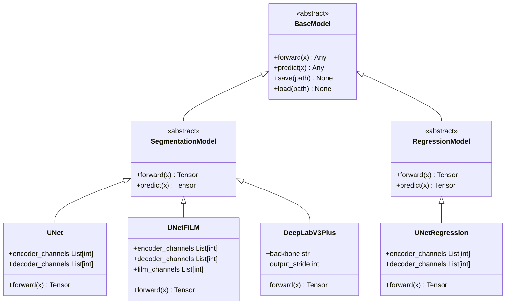
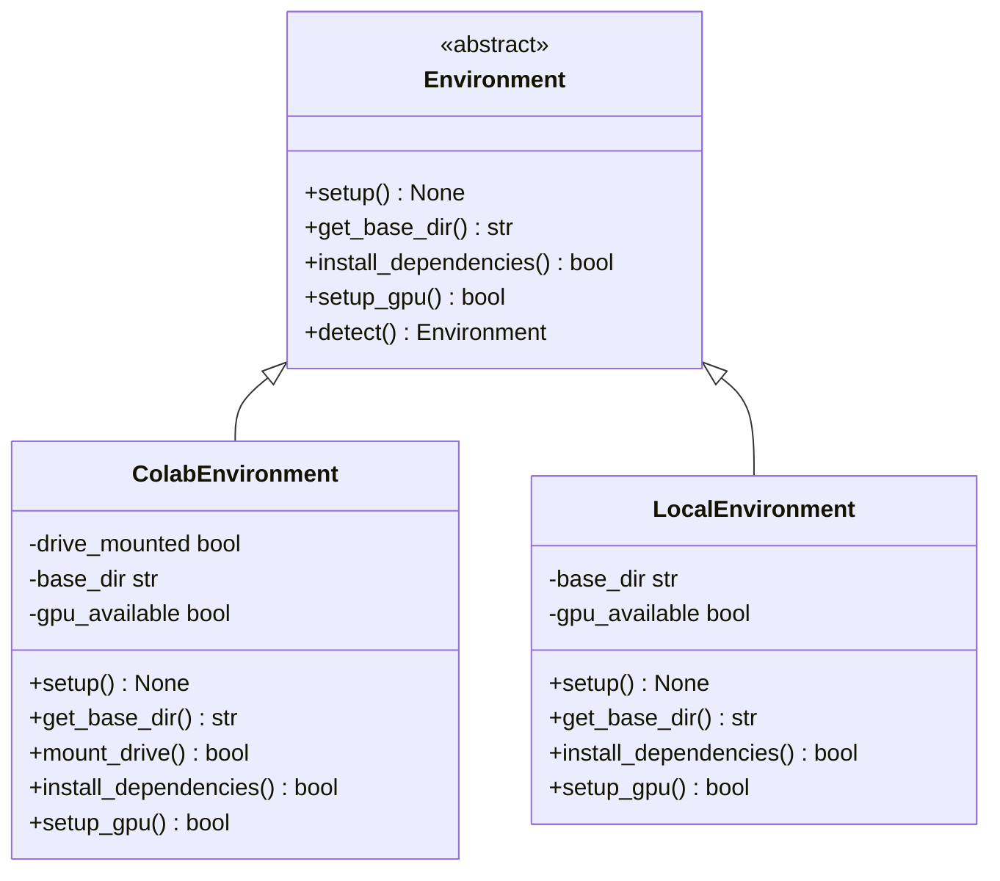
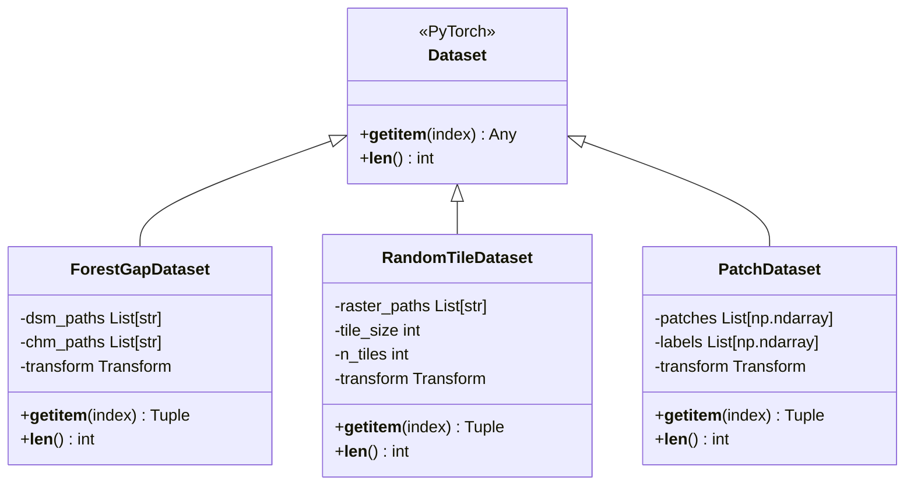
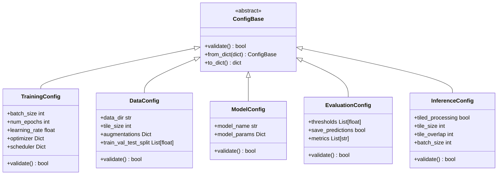
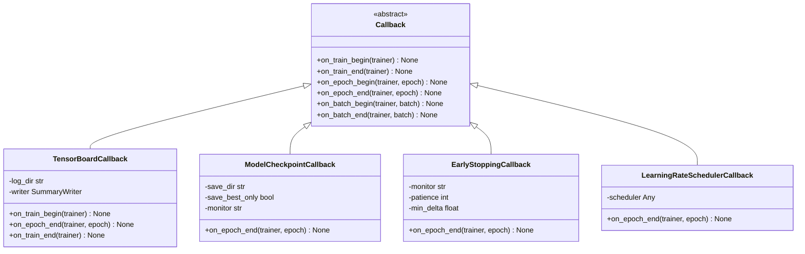
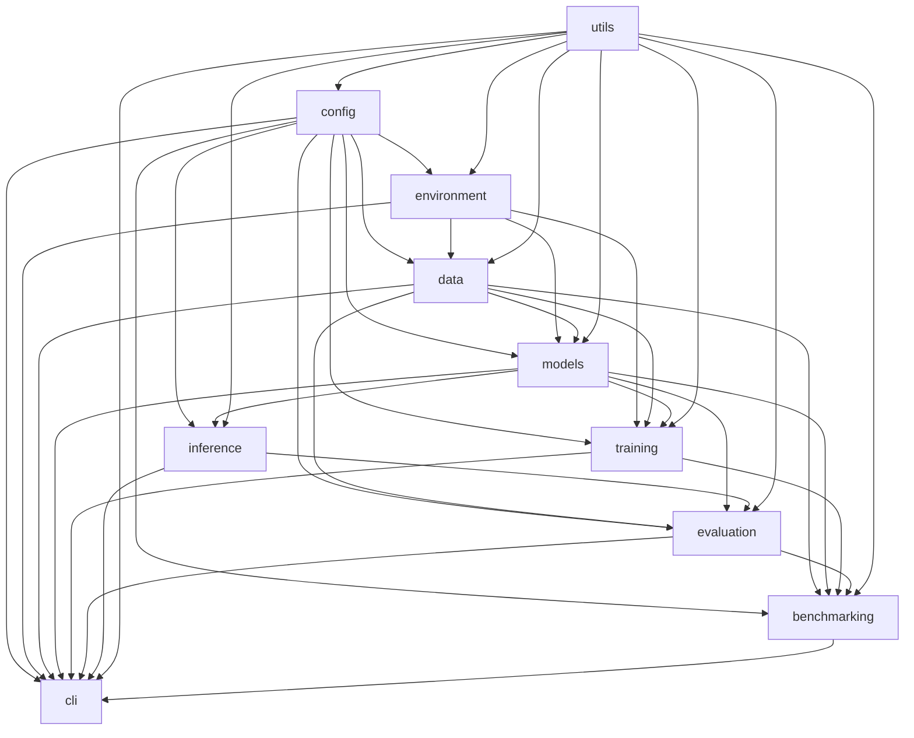
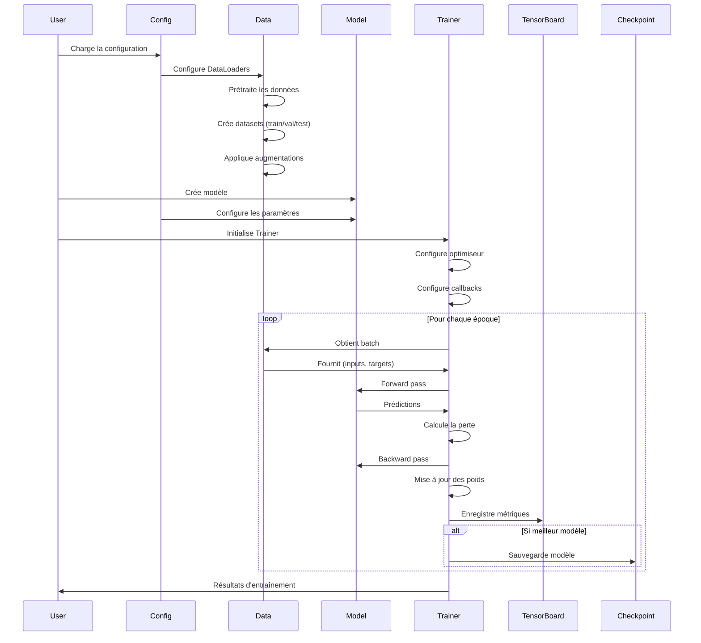
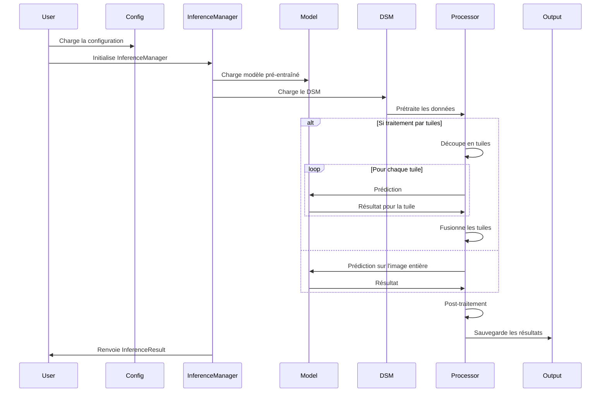

# Documentation technique complète de ForestGaps

## 1. Introduction générale

### Contexte

ForestGaps est une bibliothèque Python modulaire conçue pour la détection et l'analyse des trouées forestières à partir d'images de télédétection, en utilisant des techniques de deep learning. Les trouées forestières sont des ouvertures dans la canopée forestière résultant de la mort d'arbres, qui jouent un rôle crucial dans la dynamique forestière et la régénération des écosystèmes.

La bibliothèque utilise des modèles numériques de surface (DSM) et des modèles de hauteur de canopée (CHM) pour la segmentation des trouées et la régression de hauteur. Ces données sont typiquement obtenues par LiDAR aéroporté ou par photogrammétrie à partir d'images aériennes ou satellites.

### Objectifs et cas d'utilisation

1. **Segmentation automatique des trouées forestières** : Identification précise des trouées dans la canopée forestière à partir de données DSM/CHM.
2. **Régression de hauteur** : Estimation de la hauteur de la canopée à partir de modèles numériques de surface.
3. **Analyse comparative** : Comparaison systématique des performances de différentes architectures de deep learning.
4. **Traitement par lots** : Application efficace des modèles à de grandes zones forestières.
5. **Compatibilité multi-environnements** : Fonctionnement transparent dans Google Colab ou en environnement local.

### Principes de codage adoptés

1. **Principes SOLID** :
   - **S**ingle Responsibility Principle : Chaque module a une responsabilité unique et bien définie
   - **O**pen/Closed Principle : L'architecture permet d'étendre les fonctionnalités sans modifier le code existant
   - **L**iskov Substitution Principle : Les classes dérivées peuvent remplacer leurs classes de base
   - **I**nterface Segregation Principle : Interfaces spécifiques préférées aux interfaces générales
   - **D**ependency Inversion Principle : Les modules dépendent d'abstractions, pas d'implémentations concrètes

2. **Conventions de codage** :
   - Conformité aux standards PEP 8
   - Documentation complète avec docstrings
   - Tests unitaires et d'intégration
   - Typage statique avec annotations de type Python

3. **Paradigmes** :
   - Programmation orientée objet
   - Design patterns (Factory, Registry, Strategy, Observer)
   - Gestion d'erreurs hiérarchique
   - Configuration externalisée et validation

### Technologies et frameworks utilisés

1. **Deep Learning** :
   - PyTorch (>= 1.8.0)
   - TorchVision (>= 0.9.0)
   - TensorBoard (>= 2.8.0)

2. **Traitement de données géospatiales** :
   - Rasterio (>= 1.2.0)
   - GeoPandas (>= 0.10.0)
   - NumPy (>= 1.19.0)
   - Pandas (>= 1.3.0)

3. **Visualisation** :
   - Matplotlib (>= 3.3.0)
   - Scikit-image (>= 0.18.0)

4. **Utilitaires** :
   - PyYAML (>= 6.0)
   - Pydantic (>= 1.8.0)
   - tqdm (>= 4.60.0)
   - Tabulate (>= 0.8.0)
   - Markdown (>= 3.3.0)

## 2. Architecture globale

### Structure détaillée du package

Le package ForestGaps est organisé de manière modulaire avec une structure hiérarchique claire :

```
forestgaps/
├── __init__.py           # Point d'entrée principal
├── __version__.py        # Définition de la version
├── environment/          # Gestion de l'environnement d'exécution
├── config/               # Gestion de la configuration
├── data/                 # Traitement et gestion des données
├── models/               # Architectures de réseaux de neurones
├── training/             # Logique d'entraînement
├── evaluation/           # Évaluation des modèles
├── inference/            # Inférence avec modèles entraînés
├── utils/                # Fonctions utilitaires
├── cli/                  # Interface en ligne de commande
├── benchmarking/         # Comparaison systématique des modèles
├── examples/             # Exemples d'utilisation
└── tests/                # Tests unitaires et d'intégration
```

### Flux de données et de contrôle

Le flux de traitement typique dans ForestGaps suit ces étapes :

1. **Configuration** : Chargement et validation des paramètres de configuration
2. **Détection d'environnement** : Identification et configuration de l'environnement (Colab/local)
3. **Prétraitement des données** : 
   - Lecture des fichiers DSM/CHM
   - Prétraitement (filtrage, alignement, normalisation)
   - Création de tuiles et masques
   - Construction de datasets PyTorch
4. **Modélisation** : 
   - Sélection d'une architecture de réseau
   - Configuration du modèle
5. **Entraînement** : 
   - Initialisation du trainer
   - Entraînement du modèle avec métriques
   - Suivi avec TensorBoard
   - Sauvegarde des checkpoints
6. **Évaluation** : 
   - Évaluation sur données de test
   - Calcul des métriques
   - Génération de rapports
7. **Inférence** : 
   - Application des modèles entraînés à de nouvelles données
   - Post-traitement des prédictions
   - Sauvegarde des résultats
8. **Benchmarking** : 
   - Comparaison systématique des performances entre modèles
   - Analyse statistique des résultats

### Dépendances entre les modules

| Module         | Dépend de                                      | Est utilisé par                             | Responsabilité principale                                |
|----------------|------------------------------------------------|--------------------------------------------|---------------------------------------------------------|
| `config`       | -                                              | Tous les autres modules                    | Gestion centralisée de la configuration du projet        |
| `environment`  | `config`, `utils`                              | `data`, `models`, `training`, `cli`        | Détection et configuration de l'environnement d'exécution|
| `data`         | `config`, `environment`, `utils`               | `models`, `training`, `cli`, `benchmarking`| Préparation, transformation et chargement des données   |
| `models`       | `config`, `utils`                              | `training`, `cli`, `benchmarking`          | Implémentation des différentes architectures de réseaux  |
| `training`     | `config`, `data`, `models`, `utils`            | `cli`, `benchmarking`                      | Entraînement, évaluation et monitoring des modèles      |
| `evaluation`   | `config`, `models`, `utils`                    | `cli`, `benchmarking`                      | Évaluation externe des modèles entraînés                |
| `inference`    | `config`, `models`, `utils`                    | `cli`, `evaluation`                        | Application des modèles à de nouvelles données          |
| `utils`        | -                                              | Tous les autres modules                    | Fonctionnalités communes et transversales               |
| `cli`          | `config`, `environment`, `data`, `models`, `training`, `benchmarking` | -                  | Interface utilisateur en ligne de commande              |
| `benchmarking` | `config`, `models`, `training`, `utils`        | `cli`                                      | Comparaison systématique des performances des modèles    |

### Patterns de conception utilisés

1. **Factory Pattern** : Utilisé pour créer des instances de modèles, optimiseurs, et datasets
   ```python
   # Exemple du pattern Factory dans les modèles
   model = create_model("unet_film", **params)
   ```

2. **Registry Pattern** : Utilisé pour enregistrer dynamiquement les implémentations de modèles
   ```python
   # Exemple du pattern Registry
   @MODEL_REGISTRY.register("unet_film")
   class UNetFiLM(BaseModel):
       # Implémentation
   ```

3. **Strategy Pattern** : Utilisé pour encapsuler différentes stratégies d'entraînement
   ```python
   # Exemple du pattern Strategy
   optimizer = create_optimizer(config.optimizer.name, model.parameters(), **config.optimizer.params)
   ```

4. **Observer Pattern** : Utilisé via le système de callbacks pour le monitoring de l'entraînement
   ```python
   # Exemple du pattern Observer via callbacks
   trainer.add_callback(TensorBoardCallback(log_dir="logs"))
   ```

5. **Template Method Pattern** : Utilisé dans les classes de base pour définir le squelette des algorithmes
   ```python
   # Exemple du pattern Template Method
   class BaseTrainer:
       def train(self):
           self._setup()
           self._train_epoch()
           self._cleanup()
   ```

## 3. Index des modules et fonctions

### Module `environment`

**Description** : Gestion de l'environnement d'exécution (détection Colab/local, configuration GPU)

**Fonctions principales** :
- `detect_environment()` : Détecte automatiquement l'environnement d'exécution
- `setup_environment()` : Configure l'environnement d'exécution
- `get_device()` : Renvoie le dispositif à utiliser (cuda/cpu)

**Classes principales** :
- `Environment` (abstract) : Classe de base pour tous les environnements
- `ColabEnvironment` : Gestion spécifique pour Google Colab
- `LocalEnvironment` : Gestion spécifique pour environnement local

### Module `evaluation`

**Description** : Évaluation des modèles entraînés sur des données externes

**Fonctions principales** :
- `evaluate_model(model_path, dsm_path, chm_path, ...)` : Évalue un modèle sur une paire DSM/CHM
- `evaluate_site(model_path, site_dsm_dir, site_chm_dir, ...)` : Évalue un modèle sur toutes les paires d'un site
- `evaluate_model_on_sites(model_path, sites_config, ...)` : Évalue un modèle sur plusieurs sites
- `compare_models(model_paths, dsm_path, chm_path, ...)` : Compare plusieurs modèles

**Classes principales** :
- `EvaluationConfig` : Configuration pour l'évaluation
- `EvaluationResult` : Encapsule les résultats d'une évaluation
- `ExternalEvaluator` : Gère le processus d'évaluation complet

### Module `inference`

**Description** : Application des modèles entraînés à de nouvelles données

**Fonctions principales** :
- `run_inference(model_path, dsm_path, output_path, ...)` : Exécute l'inférence sur un fichier DSM
- `run_batch_inference(model_path, dsm_paths, output_dir, ...)` : Traite plusieurs fichiers DSM
- `predict_from_model(model, dsm, ...)` : Exécute l'inférence avec un modèle déjà chargé

**Classes principales** :
- `InferenceConfig` : Configuration pour l'inférence
- `InferenceResult` : Encapsule les résultats d'une inférence
- `InferenceManager` : Gère le processus d'inférence complet

### Module `config`

**Description** : Gestion centralisée de la configuration du projet

**Fonctions principales** :
- `load_config_from_file(config_path)` : Charge une configuration depuis un fichier YAML
- `load_default_config()` : Charge la configuration par défaut
- `save_config_to_file(config, config_path)` : Sauvegarde une configuration

**Classes principales** :
- `ConfigBase` : Classe de base pour toutes les configurations avec validation

### Module `data`

**Description** : Traitement et gestion des données géospatiales

**Fonctions principales** :
- `process_raster_pair_robustly(dsm_path, chm_path, ...)` : Prétraite une paire DSM/CHM
- `create_gap_masks(chm_path, thresholds, ...)` : Crée des masques de trouées à différents seuils
- `create_tiles_from_raster(raster_path, ...)` : Découpe un raster en tuiles
- `create_data_loaders(config)` : Crée des DataLoaders PyTorch

**Classes principales** :
- `ForestGapDataset` : Dataset PyTorch pour les données de trouées forestières
- `RandomTileDataset` : Dataset qui génère des tuiles aléatoires à partir de rasters

### Module `models`

**Description** : Architectures de réseaux de neurones pour la détection de trouées

**Fonctions principales** :
- `create_model(model_name, **kwargs)` : Crée une instance de modèle
- `save_model(model, path, ...)` : Sauvegarde un modèle avec ses métadonnées
- `load_model(path, ...)` : Charge un modèle avec ses métadonnées

**Classes principales** :
- `BaseModel` : Classe abstraite pour tous les modèles
- `UNet` : Implémentation de l'architecture U-Net
- `UNetFiLM` : U-Net avec Feature-wise Linear Modulation
- `DeepLabV3Plus` : Implémentation de DeepLabV3+
- `UNetRegression` : U-Net pour les tâches de régression

### Module `training`

**Description** : Logique d'entraînement des modèles

**Fonctions principales** :
- `train_model(model, data_loaders, config, ...)` : Entraîne un modèle
- `create_optimizer(optimizer_name, parameters, ...)` : Crée un optimiseur
- `create_scheduler(scheduler_name, optimizer, ...)` : Crée un scheduler de taux d'apprentissage

**Classes principales** :
- `Trainer` : Gère l'entraînement complet d'un modèle
- `LossFunction` : Classe de base pour les fonctions de perte
- `Metric` : Classe de base pour les métriques d'évaluation
- `Callback` : Classe de base pour les callbacks d'entraînement

### Module `utils`

**Description** : Fonctionnalités communes et transversales

**Sous-modules** :
- `utils.visualization` : Visualisation des données et résultats
- `utils.io` : Opérations d'entrée/sortie
- `utils.profiling` : Outils de profilage
- `utils.errors` : Gestion hiérarchique des erreurs

### Module `cli`

**Description** : Interface utilisateur en ligne de commande

**Fonctions principales** :
- `preprocessing_cli.main()` : Point d'entrée pour le CLI de prétraitement
- `training_cli.main()` : Point d'entrée pour le CLI d'entraînement

### Module `benchmarking`

**Description** : Comparaison systématique des performances de modèles

**Classes principales** :
- `ModelComparison` : Gère la comparaison entre plusieurs modèles
- `BenchmarkResult` : Encapsule les résultats d'un benchmark

## 4. Abstractions clés

### Hiérarchie des modèles



### Hiérarchie des environnements



### Hiérarchie des datasets



### Hiérarchie des configurations



### Hiérarchie des callbacks



## 5. Fichiers clés

### Fichiers essentiels

1. **`__init__.py`** : Point d'entrée du package, expose les fonctionnalités principales
   - Importance : Définit l'interface publique du package
   - Dépendances : Importe des modules principaux

2. **`__version__.py`** : Définit la version du package
   - Importance : Permet de suivre les versions du package
   - Dépendances : Utilisé par setup.py et les logs

3. **`setup.py`** : Configuration de l'installation du package
   - Importance : Définit les dépendances et les métadonnées du package
   - Dépendances : Lit __version__.py

4. **`environment/__init__.py`** : Définit les fonctions de gestion d'environnement
   - Importance : Point d'entrée pour la configuration de l'environnement
   - Dépendances : Utilise environment/base.py, environment/colab.py, environment/local.py

5. **`environment/base.py`** : Classe de base pour les environnements
   - Importance : Définit l'interface commune pour tous les environnements
   - Dépendances : Utilisé par tous les autres modules d'environnement

6. **`evaluation/core.py`** : Classes principales pour l'évaluation
   - Importance : Contient la logique d'évaluation des modèles
   - Dépendances : Utilise models, utils, et les métriques d'évaluation

7. **`inference/core.py`** : Classes principales pour l'inférence
   - Importance : Contient la logique d'inférence des modèles
   - Dépendances : Utilise models, utils, et les fonctions de traitement d'images

### Interdépendances critiques

1. **Configuration ↔ Tous les modules** :
   - Tous les modules dépendent de la configuration pour leurs paramètres
   - Maintenir la cohérence des schémas de configuration entre modules

2. **Environment ↔ Data/Models/Training** :
   - Les modules de données, modèles et entraînement s'adaptent à l'environnement
   - Assure la compatibilité entre Google Colab et environnement local

3. **Models ↔ Training/Evaluation/Inference** :
   - Les modules d'entraînement, d'évaluation et d'inférence utilisent les modèles
   - Les modèles doivent maintenir une interface cohérente pour ces modules

4. **Utils ↔ Tous les modules** :
   - Les utilitaires sont utilisés par tous les modules
   - Modifications dans utils peuvent affecter l'ensemble du package

## 6. Diagrammes et visualisations

### Diagramme global des modules



### Flux de données pour l'entraînement



### Flux de données pour l'inférence



## 7. Informations des README

### Points clés du README principal

- ForestGaps est un package modulaire pour la détection et l'analyse des trouées forestières
- Utilise des techniques de deep learning sur des modèles numériques de surface (DSM) et de hauteur de canopée (CHM)
- Implémente plusieurs architectures (U-Net, DeepLabV3+, etc.)
- Structure modulaire suivant les principes SOLID
- Compatible avec Google Colab et environnement local

### Points clés du README du module environment

- Système de détection et configuration automatique de l'environnement
- Supporte Google Colab et environnement local
- Fonctionnalités : montage de Google Drive, installation de dépendances, configuration GPU
- Interface unifiée via la classe abstraite Environment
- Intégration avec le module de configuration

### Points clés du README du module evaluation

- Évaluation des modèles entraînés sur des paires DSM/CHM indépendantes
- Calcul de métriques détaillées (précision, rappel, F1, IoU, etc.)
- Évaluation sur paires uniques, sites complets ou multi-sites
- Comparaison entre différents modèles
- Génération de rapports avec visualisations

### Points clés du README du module inference

- Application des modèles entraînés à de nouvelles données DSM
- Traitement efficace via découpage en tuiles pour grandes images
- Préservation des métadonnées géospatiales
- Inférence sur fichiers uniques ou par lots
- Visualisation et exportation des résultats

### Points clés du README du module config (non fourni mais inféré)

- Gestion centralisée de la configuration via fichiers YAML
- Validation des configurations avec schémas
- Configurations par défaut pour tous les modules
- Interface cohérente pour l'accès aux paramètres

### Points clés du README du module data (non fourni mais inféré)

- Traitement de données raster (DSM, CHM)
- Prétraitement, génération de tuiles et masques
- Datasets PyTorch pour segmentation et régression
- DataLoaders optimisés

### Points clés du README du module models (non fourni mais inféré)

- Implémentation de différentes architectures (U-Net, DeepLabV3+, etc.)
- Système de registre pour ajouter facilement de nouveaux modèles
- Classes abstraites et de base pour assurer la cohérence
- Export et chargement de modèles pré-entraînés

### Points clés du README du module training (non fourni mais inféré)

- Système d'entraînement flexible et modulaire
- Métriques d'évaluation personnalisables
- Fonctions de perte adaptées à la détection de trouées
- Système de callbacks pour le monitoring

### Points clés du README du module utils (non fourni mais inféré)

- Fonctionnalités communes et transversales
- Visualisation des données et résultats
- Opérations d'entrée/sortie optimisées
- Outils de profilage

### Points clés du README du module benchmarking (non fourni mais inféré)

- Comparaison systématique des performances entre modèles
- Analyse statistique des résultats
- Visualisations comparatives
- Génération de rapports 